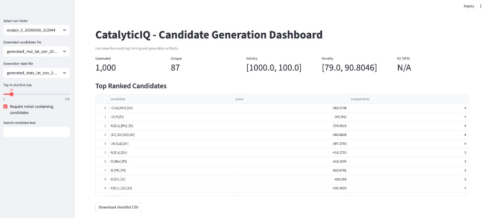
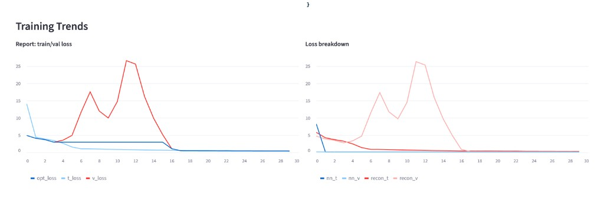
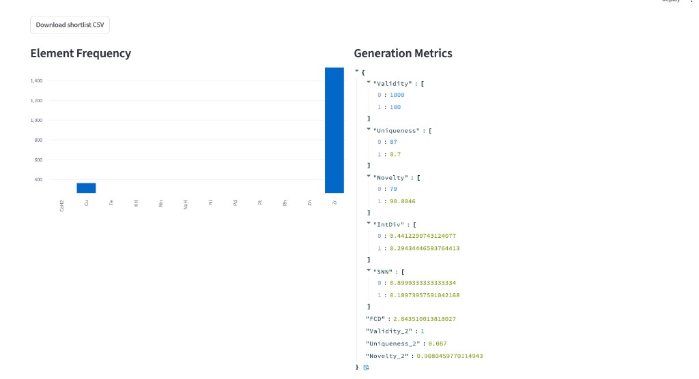

# CatalyticIQ

CatalyticIQ is the Round 2 prototype for **Theme 4: AI Platform for Molecular Discovery in Chemical Catalysis and Synthetic Biology**, submitted by team CatalyticIQ for the GPS Renewables / IIT-D hackathon.

It runs a closed end-to-end discovery loop for **CO2 + green H2 -> methanol**, with the architecture extensible to syngas->ethanol and ethanol->jet pilot stages.

## What the prototype does

```
researcher -> reaction
            -> retrieve known catalysts (Materials Project, Open Catalyst)
            -> generate novel candidates (reaction-conditioned CVAE)
            -> predict activity, selectivity, stability (latent-MLP heads + descriptor)
            -> estimate reaction-energy diagram (heuristic / xTB / DFT tiers)
            -> rank, visualise, export
            -> log lab results
            -> retrain heads (with PSI drift guard) -> versioned model -> back to top
```

### Implemented in this prototype

- **CO2->methanol data pipeline**: TheMeCat + Suvarna -> `dataset/co2_methanol.csv` (legacy) and `dataset/co2_methanol_full.csv` (with MeOH selectivity / CO2 conversion / yield columns).
- **Reaction-conditioned generative VAE**, fine-tuned 30 epochs (`dataset/co2_methanol/output_0_20260428_212044/`, val loss 14.07 -> 0.43, 100% chemical validity).
- **Post-processing**: dedup, support-to-oxide mapping, score calibration (`scripts/postprocess_candidates.py`).
- **Multi-property prediction**:
  - `ActivityHead` MLP on the latent embedding (R^2 = 0.755, MAE = 0.10 g/h/g_cat).
  - `SelectivityHead` MLP on the same embedding (R^2 = 0.43 on TheMeCat selectivity rows).
  - `StabilityHead` descriptor proxy (Tammann / Hüttig temperatures + redox class).
- **Reaction-energy diagrams** (`catcvae/reaction_energy.py`) with three pluggable backends:
  - Tier A `heuristic_scaling` (always on, literature binding-energy table).
  - Tier B `xtb_topn` (GFN2-xTB via xtb-python on a 19-atom cluster surrogate).
  - Tier C `dft_topk` (Open Catalyst Project IS2RE match / GPAW PBE-D3 single-point).
- **External database retrieval**:
  - `services/retrieval/materials_project.py` (mp-api with `MP_API_KEY`, offline cache fallback).
  - `services/retrieval/open_catalyst.py` (fairchem live, offline binding-energy seed).
  - `services/retrieval/cache.py` DuckDB cache with provenance log.
- **Encoder validation suite** (`scripts/validate_encoder.py`): held-out R^2 0.755 with 93% 90% interval coverage, latent-neighbour Jaccard 0.92, top-decile coherence 48%, active-learning recovery 8/20 in top-50, Pareto comparison vs random and GA baselines.
- **Lab feedback loop**:
  - `services/feedback/store.py` DuckDB store with append-only experiments + model_versions.
  - `scripts/retrain_with_feedback.py` heads-mode and CVAE-mode with PSI drift guard.
- **Dashboard**: `app.py` Streamlit app with six tabs — Discover, Pathway, Compare, Knowledge Base, Validation, Feedback.

### Roadmap (post-Round 2 pilot)

- Stage B: syngas -> ethanol (PNNL + Zenodo:11113829).
- Stage C: ethanol -> jet (GPS Renewables proprietary lab data).
- Direction 2: synthetic biology track (BRENDA + ESM/AlphaFold).
- Multi-user collaboration (auth, roles, per-user audit), full lab system integrations.
- High-fidelity simulation: COMSOL .mph reactor model + surrogate.

## Quick start

### 1. Environment (Apple Silicon)

```bash
conda env create -f catalyticiq-osx-arm64.yml
conda activate catalyticiq
python -m pip install pyg-lib torch-scatter torch-sparse torch-cluster torch-spline-conv -f https://data.pyg.org/whl/torch-2.2.0+cpu.html
python -m pip install torch-geometric==2.5.2 duckdb openpyxl torchmetrics streamlit
```

### 2. Build the merged CO2->methanol dataset

```bash
python scripts/prepare_co2_methanol_dataset.py \
  --themecat dataset/raw/TheMeCat_v1.csv \
  --suvarna dataset/raw/Suvarna_2022.xlsx \
  --output dataset/co2_methanol.csv
```

This emits both `dataset/co2_methanol.csv` (legacy schema for the CVAE) and `dataset/co2_methanol_full.csv` (with selectivity / conversion / yield columns).

### 3. Fine-tune the CVAE

```bash
python main_finetune.py \
  --file co2_methanol \
  --pretrained_file ord \
  --pretrained_time ord_pretrained_aug5 \
  --epochs 30 --lr 0.0005 --class_weight enabled
```

### 4. Generate candidates

```bash
python generation.py \
  --file co2_methanol \
  --pretrained_file co2_methanol \
  --pretrained_time <timestamp> \
  --correction enabled --from_around_mol enabled
```

### 5. Post-process generation

```bash
python scripts/postprocess_candidates.py \
  --candidates dataset/co2_methanol/output_0_<timestamp>/generated_mol_lat_con_<ts>.csv \
  --training dataset/co2_methanol.csv
```

### 6. Train property heads

```bash
python scripts/train_property_heads.py --pretrained_time <timestamp> --epochs 100
```

### 7. Validate the encoder

```bash
python scripts/validate_encoder.py
```

### 8. Launch the dashboard

```bash
streamlit run app.py
```

The dashboard reads everything in `dataset/co2_methanol/output_*`, `dataset/co2_methanol/property_heads/`, `dataset/co2_methanol/validation/`, plus `cache/retrieval.duckdb` and `cache/feedback.duckdb`.

### 9. Feedback retrain (after lab results land)

```bash
# Cheap heads-only refresh (default, safe for small N)
python scripts/retrain_with_feedback.py --mode heads --epochs 80 --promote

# Or schedule a full CVAE refit (refuses if PSI > 0.25 or N < 25 unless --force)
python scripts/retrain_with_feedback.py --mode cvae
```

## Documentation

- [Round 1 written submission](docs/theme4-round1-solution.md)
- [Final submission description](docs/final-submission-description.md)
- [Round 2 demo script](docs/round2-demo-script.md)
- [Build and positioning playbook](docs/build-and-positioning-playbook.md)

## Dashboard preview






