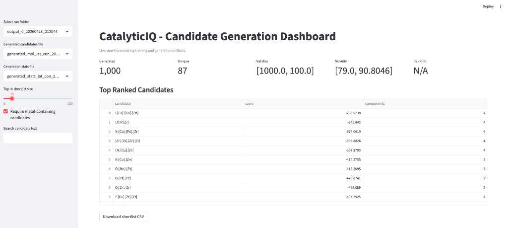
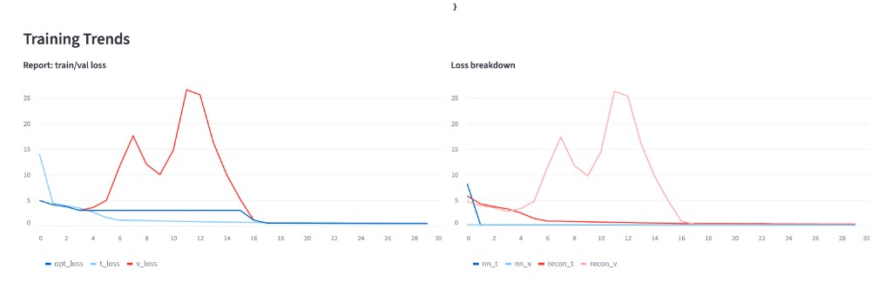
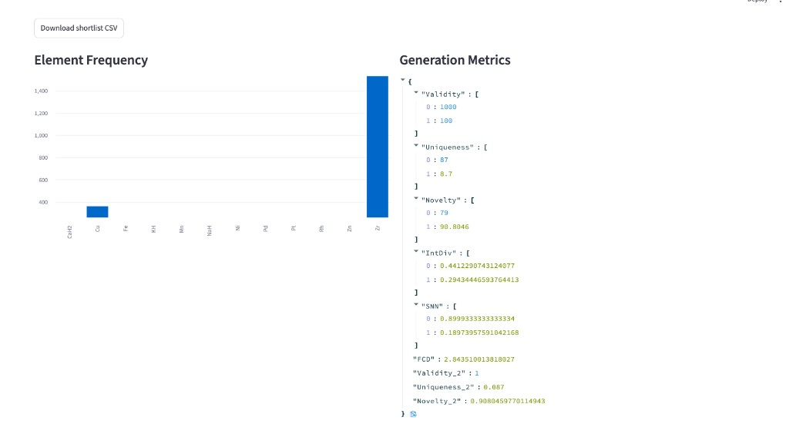

# CatalyticIQ

CatalyticIQ is the Round 2 prototype for **Theme 4: AI Platform for Molecular Discovery in Chemical Catalysis and Synthetic Biology**, submitted by team CatalyticIQ for the GPS Renewables / IIT-D hackathon.

It runs a closed end-to-end discovery loop for **CO2 + green H2 -> methanol**, with the architecture extensible to syngas->ethanol and ethanol->jet pilot stages.

## What the prototype does

```
researcher -> reaction
            -> retrieve known catalysts (Materials Project, Open Catalyst)
            -> generate novel candidates (reaction-conditioned CVAE)
            -> predict activity, selectivity, stability (latent-MLP heads + descriptor)
            -> validate with thermodynamic/reactor simulation + reaction-energy diagrams
            -> rank, visualise, export
            -> log lab results
            -> retrain heads (with PSI drift guard) -> versioned model -> back to top
```

### Implemented in this prototype

- **CO2->methanol data pipeline**: TheMeCat + Suvarna -> `dataset/co2_methanol.csv` (legacy) and `dataset/co2_methanol_full.csv` (with MeOH selectivity / CO2 conversion / yield columns).
- **Reaction-conditioned generative VAE**, initialized from the local ORD pretrained checkpoint (`dataset/ord/output_0_ord_pretrained_aug5/`) and fine-tuned for CO2->methanol (`dataset/co2_methanol/output_0_20260503_190505/`, best validation loss 4.2088, 100% validity in the latest run).
- **Post-processing**: dedup, support-to-oxide mapping, score calibration (`scripts/postprocess_candidates.py`).
- **Multi-property prediction**:
  - `ActivityHead` MLP on the latent embedding (R^2 = 0.755, MAE = 0.10 g/h/g_cat).
  - `SelectivityHead` MLP on the same embedding (R^2 = 0.43 on TheMeCat selectivity rows).
  - `StabilityHead` descriptor proxy (Tammann / Hüttig temperatures + redox class).
- **YAML-driven simulation validation** (`services/simulation/cantera_validator.py` + `config/reactions/*.yaml`): analytic van't Hoff equilibrium, pressure-corrected conversion solve, catalyst descriptor score, and Cantera equilibrium cross-check when the selected mechanism contains the required species. The YAML defines reaction stoichiometry plus sweep ranges; `scripts/generate_cantera_sweep.py` turns those ranges into simulation-labelled CSV rows for surrogate training. The current CO2 artifact reports `yaml_cantera_plus_analytic_microkinetic`.
- **Reaction-energy diagrams** (`catcvae/reaction_energy.py`) with three pluggable backends:
  - Tier A `heuristic_scaling` (always on, literature binding-energy table).
  - Tier B `xtb_topn` (GFN2-xTB via xtb-python on a 19-atom cluster surrogate).
  - Tier C `dft_topk` (Open Catalyst Project IS2RE match / GPAW PBE-D3 single-point).
- **External database retrieval**:
  - `services/retrieval/materials_project.py` (mp-api with `MP_API_KEY`, offline cache fallback).
  - `services/retrieval/open_catalyst.py` (fairchem live, offline binding-energy seed).
  - `services/retrieval/cache.py` DuckDB cache with provenance log.
- **Encoder validation suite** (`scripts/validate_encoder.py`): held-out R^2 0.755 with 93% 90% interval coverage, latent-neighbour Jaccard 0.92, top-decile coherence 48%, active-learning recovery 8/20 in top-50, Pareto comparison vs random and GA baselines.
- **Lab feedback loop**:
  - `services/feedback/store.py` DuckDB store with append-only experiments + model_versions.
  - `scripts/retrain_with_feedback.py` heads-mode and CVAE-mode with PSI drift guard.
- **Dashboard**: `app.py` Streamlit app with six tabs — Discover, Pathway, Compare, Knowledge Base, Validation, Feedback.

### How to test the current CO2 demo build

```bash
conda run -n catdrx python -m py_compile \
  app.py \
  services/simulation/reaction_config.py \
  services/simulation/cantera_validator.py \
  scripts/postprocess_candidates.py \
  scripts/validate_shortlist_simulation.py \
  scripts/generate_cantera_sweep.py \
  scripts/train_simulation_surrogate.py
```

```bash
conda run -n catdrx python scripts/validate_shortlist_simulation.py \
  --candidates dataset/co2_methanol/output_0_20260503_190505/generated_candidates_clean.csv \
  --reaction-config config/reactions/co2_methanol.yaml \
  --output dataset/co2_methanol/output_0_20260503_190505/simulation_validation.csv
```

Expected backend in `simulation_validation.csv`:

```text
yaml_cantera_plus_analytic_microkinetic
```

Generate a smoke simulation sweep from the YAML ranges:

```bash
conda run -n catdrx python scripts/generate_cantera_sweep.py \
  --reaction-config config/reactions/co2_methanol.yaml \
  --candidates dataset/co2_methanol/output_0_20260503_190505/generated_candidates_clean.csv \
  --output dataset/simulation/co2_methanol_sweep_smoke.csv \
  --n-samples 3 \
  --limit-candidates 3
```

Train a fast surrogate on the sweep output:

```bash
conda run -n catdrx python scripts/train_simulation_surrogate.py \
  --input dataset/simulation/co2_methanol_sweep_smoke.csv \
  --target simulated_sty_g_h_gcat \
  --output-dir dataset/simulation/surrogates/co2_methanol_smoke
```

Launch the dashboard:

```bash
conda run --no-capture-output -n catdrx streamlit run app.py --server.port 8501 --server.address 127.0.0.1
```

### Release sequencing (CO2 build)

1. Regenerate validation PDF/JSON and enforce thresholds: `bash scripts/release_check_co2.sh`
2. Criteria live in `config/release_criteria_co2.json` (edit min R² / MAE / coverage as needed).
3. Syngas→ethanol: `python scripts/prepare_syngas_ethanol_dataset.py --input /path/to/source.csv` then `bash scripts/finetune_syngas_ethanol.sh`; property heads use `python scripts/train_property_heads.py --file syngas_ethanol --pretrained_time <ts>` and `python scripts/validate_encoder.py --dataset syngas_ethanol`.

### Roadmap (post-Round 2 pilot)

- Stage B: syngas -> ethanol (cleaned Zenodo 11639494 HAS data -> `dataset/syngas_ethanol.csv`; latest clean rerun `dataset/syngas_ethanol/output_0_20260505_172240/`).
- Stage C: ethanol -> jet (GPS Renewables proprietary lab data).
- Direction 2: synthetic biology track (BRENDA + ESM/AlphaFold).
- Multi-user collaboration (auth, roles, per-user audit), full lab system integrations.
- High-fidelity pilot simulation: Cantera mechanism refinement, CatMAP-style microkinetics, FairChem/OCP adsorption energies, and GPS-specific reactor models.

## Quick start

### 1. Environment (Apple Silicon)

```bash
conda env create -f catalyticiq-osx-arm64.yml
conda activate catalyticiq
python -m pip install pyg-lib torch-scatter torch-sparse torch-cluster torch-spline-conv -f https://data.pyg.org/whl/torch-2.2.0+cpu.html
python -m pip install torch-geometric==2.5.2 duckdb openpyxl torchmetrics streamlit
conda install -c conda-forge cantera
```

### 2. Build the merged CO2->methanol dataset

```bash
python scripts/prepare_co2_methanol_dataset.py \
  --themecat dataset/raw/TheMeCat_v1.csv \
  --suvarna dataset/raw/Suvarna_2022.xlsx \
  --output dataset/co2_methanol.csv
```

This emits both `dataset/co2_methanol.csv` (legacy schema for the CVAE) and `dataset/co2_methanol_full.csv` (with selectivity / conversion / yield columns).

### 3. Fine-tune the CVAE

```bash
python main_finetune.py \
  --file co2_methanol \
  --pretrained_file ord \
  --pretrained_time ord_pretrained_aug5 \
  --epochs 30 --lr 0.0005 --class_weight enabled
```

### 4. Generate candidates

```bash
python generation.py \
  --file co2_methanol \
  --pretrained_file co2_methanol \
  --pretrained_time <timestamp> \
  --correction enabled --from_around_mol enabled
```

### 5. Post-process generation

```bash
python scripts/postprocess_candidates.py \
  --candidates dataset/co2_methanol/output_0_<timestamp>/generated_mol_lat_con_<ts>.csv \
  --training dataset/co2_methanol.csv
```

### 5b. Simulation validation

```bash
python scripts/validate_shortlist_simulation.py \
  --candidates dataset/co2_methanol/output_0_<timestamp>/generated_candidates_clean.csv \
  --reaction-config config/reactions/co2_methanol.yaml \
  --temperature-c 240 \
  --pressure-bar 50
```

### 5c. Generate simulation sweep data

The YAML is the reaction contract. It defines stoichiometry, feed, default
conditions, catalyst descriptors, and sweep ranges. The sweep script samples
those ranges and writes simulation-labelled training data:

```bash
python scripts/generate_cantera_sweep.py \
  --reaction-config config/reactions/co2_methanol.yaml \
  --candidates dataset/co2_methanol/output_0_<timestamp>/generated_candidates_clean.csv \
  --output dataset/simulation/co2_methanol_sweep.csv
```

For a quick local check:

```bash
python scripts/generate_cantera_sweep.py \
  --reaction-config config/reactions/co2_methanol.yaml \
  --candidates dataset/co2_methanol/output_0_<timestamp>/generated_candidates_clean.csv \
  --output dataset/simulation/co2_methanol_sweep_smoke.csv \
  --n-samples 3 \
  --limit-candidates 3
```

### 5d. Train the simulation surrogate

```bash
python scripts/train_simulation_surrogate.py \
  --input dataset/simulation/co2_methanol_sweep.csv \
  --target simulated_sty_g_h_gcat \
  --output-dir dataset/simulation/surrogates/co2_methanol
```

Re-rank the shortlist with the **validated ActivityHead** (same μ as `validate_encoder`), instead of the raw CVAE `NN_PREDICTION` score:

```bash
python scripts/postprocess_candidates.py \
  --candidates dataset/co2_methanol/output_0_<timestamp>/generated_mol_lat_con_<ts>.csv \
  --training dataset/co2_methanol.csv \
  --use-activity-head \
  --cvae-run-dir dataset/co2_methanol/output_0_<timestamp>
```

### 6. Train property heads

```bash
python scripts/train_property_heads.py --pretrained_time <timestamp> --epochs 100
```

### 7. Validate the encoder

```bash
python scripts/validate_encoder.py
```

### 8. Launch the dashboard

```bash
streamlit run app.py
```

The dashboard reads everything in `dataset/co2_methanol/output_*`, `dataset/co2_methanol/property_heads/`, `dataset/co2_methanol/validation/`, plus `cache/retrieval.duckdb` and `cache/feedback.duckdb`.

### 9. Feedback retrain (after lab results land)

```bash
# Cheap heads-only refresh (default, safe for small N)
python scripts/retrain_with_feedback.py --mode heads --epochs 80 --promote

# Or schedule a full CVAE refit (refuses if PSI > 0.25 or N < 25 unless --force)
python scripts/retrain_with_feedback.py --mode cvae
```

## Documentation

- [Round 1 written submission](docs/theme4-round1-solution.md)
- [Final submission description](docs/final-submission-description.md)
- [Round 2 demo script](docs/round2-demo-script.md)
- [Simulation validation architecture](docs/simulation-validation-architecture.md)
- [Build and positioning playbook](docs/build-and-positioning-playbook.md)

## Dashboard preview






